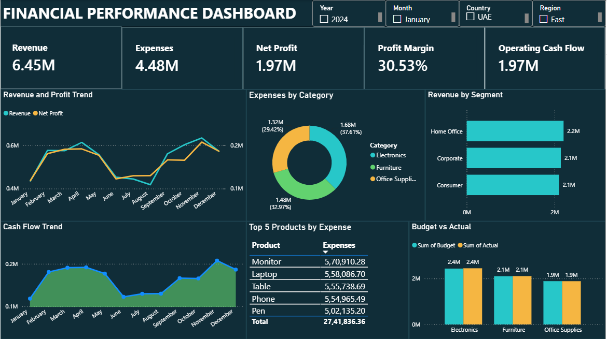

# Power-BI-Financial-Performance-Dashboard
Interactive Financial Performance Dashboard built using Power BI, DAX, Power Query and Excel.

## Project Overview

This project is an interactive Financial Performance Dashboard created using Power BI.

The dashboard helps analyze financial performance and provides insights into revenue, expenses, profit, cash flow and budget performance.

## Tools Used

- Power BI
- DAX
- Power Query
- Microsoft Excel
- Data Visualization

## Dashboard Features

- Revenue Analysis
- Expense Analysis
- Net Profit
- Profit Margin
- Operating Cash Flow
- Revenue by Segment
- Expenses by Category
- Budget vs Actual
- Top Products by Expenses

## Interactive Filters

- Year
- Month
- Country
- Region

## Key Skills

- Data Cleaning
- Data Transformation
- Data Analysis
- DAX Calculations
- Data Visualization
- Dashboard Development

## Dashboard Preview

